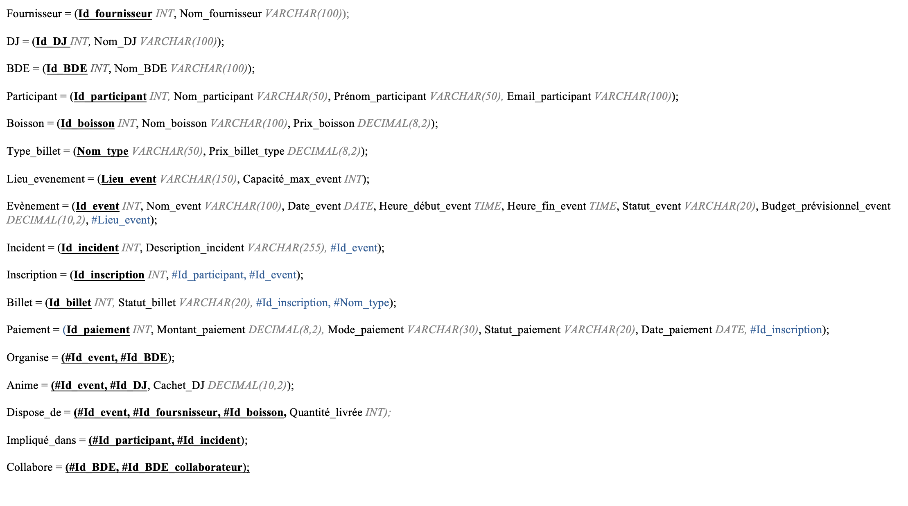

                                                  ** README Selene Akdogan / Victor Vaures **

## PARTIE 1
## Prompt :

Tu travailles dans le domaine de l’organisation professionnelle de soirées étudiantes et d’événements universitaires.
Ton entreprise a comme activité l’organisation et la gestion complète d’événements étudiants tels que des soirées d’intégration, galas, afterworks, soirées à thème et festivals inter-écoles.
C’est une entreprise événementielle privée comparable à des agences spécialisées dans l’événementiel étudiant comme Alliance Événement, Magnum Event ou Student Event Agency.
Les données ont été collectées à partir d’entretiens avec les organisateurs d’événements et de retours d’expérience issus de la gestion de bars étudiants et professionnels, de boîtes de nuit et de festivals universitaires.
Inspire-toi des sites web suivant :
- https://www.eventbrite.fr
- https://www.shotgun.live

Ton entreprise veut appliquer MERISE pour concevoir un système d'information. Tu es chargé de la partie analyse, c’est-à-dire de collecter les besoins auprès de l’entreprise. Elle a fait appel à un étudiant en ingénierie informatique pour réaliser ce projet, tu dois lui fournir les informations nécessaires pour qu’il applique ensuite lui-même les étapes suivantes de conception et développement de la base de données. L’étudiant ne s’y connait pas en soirée, donc tu ne dois pas utiliser de vocabulaire technique, éviter les redondances et assurer une cohérence logique.

D’abord, établis avec précision les règles de gestion des données de ton entreprise, sous la forme d'une liste à puce. Elle doit correspondre aux informations que fournit quelqu’un qui connaît le fonctionnement de l’entreprise, mais pas comment se construit un système d’information. Les cardinalités doivent être déductibles.

Ensuite, à partir de ces règles, fournis un dictionnaire de données brutes avec les colonnes suivantes, regroupées dans un tableau : signification de la donnée, type, taille en nombre de caractères ou de chiffres. La taille et le type doivent respecter les types donné dans Looping. Il doit y avoir entre 25 et 35 données. Il sert à fournir des informations supplémentaires sur chaque donnée (taille et type) mais sans a priori sur comment les données vont être modélisées ensuite.
Fournis donc les règles de gestion et le dictionnaire de données.

#

## Règles métiers :

- Chaque événement possède un identifiant unique.
- Un événement a un nom, une date, une heure de début et une heure de fin, un lieu, une capacité maximale et un statut (prévu, annulé, terminé).
- Chaque événement possède un budget prévisionnel fixé avant sa réalisation.
- Un événement peut être organisé en partenariat avec un ou plusieurs BDE.
- Un BDE peut participer à l’organisation de plusieurs événements.
- Des BDE peuvent collaborer entre eux pour organiser un même événement.
- Chaque participant doit être enregistré pour pouvoir s’inscrire à un événement.
- Un participant possède un identifiant unique, un nom, un prénom et un email.
- Un participant peut s’inscrire à plusieurs événements.
- Chaque inscription possède un identifiant unique.
- Une inscription est nominative et liée à un seul participant et un seul événement.
- Une inscription correspond à un seul billet.
- Une inscription peut être gratuite ou payante.
- Une inscription peut donner lieu à un paiement.
- Chaque billet possède un identifiant unique, une catégorie (standard, VIP, early…), un prix associé et un statut (valide, annulé, utilisé).
- Un billet est associé à une seule inscription, et donc à un seul événement.
- Un participant peut détenir plusieurs billets pour différents événements.
- Un paiement correspond à une seule inscription.
- Un paiement possède un montant, un mode (CB, espèces, virement), un statut (accepté, refusé, en attente) et une date de paiement.
- Un DJ peut être programmé pour un ou plusieurs événements.
- Un événement peut accueillir un ou plusieurs DJ.
- Chaque DJ possède un identifiant unique et un nom.
- Pour chaque prestation d’un DJ lors d’un événement, un cachet est défini et enregistré.
- Un fournisseur peut fournir plusieurs boissons.
- Une boisson peut être fournie par plusieurs fournisseurs.
- Chaque boisson possède un identifiant unique, un nom et un prix unitaire.
- Pour chaque relation entre un fournisseur, une boisson et un événement, la quantité livrée est enregistrée.
- Un événement peut être associé à zéro ou plusieurs incidents.
- Tout incident survenu pendant un événement doit être enregistré.
- Un incident est associé à un événement précis.
- Un incident peut impliquer un ou plusieurs participants.
- Chaque incident possède un identifiant unique et une description.

## 

## Dictionnaire de données :

| Signification de la donnée              | Type (Looping)   | Taille |
|----------------------------------------|------------------|--------|
| Identifiant événement                  | Entier           | 6      |
| Nom événement                          | Texte            | 100    |
| Date événement                         | Date             | —      |
| Heure début événement                  | Heure            | —      |
| Heure fin événement                    | Heure            | —      |
| Lieu événement                         | Texte            | 150    |
| Capacité maximale                      | Entier           | 5      |
| Statut événement                       | Texte            | 20     |
| Budget prévisionnel                    | Décimal (10,2)   | 10     |
| Identifiant BDE                        | Entier           | 5      |
| Nom BDE                                | Texte            | 100    |
| Identifiant participant                | Entier           | 6      |
| Nom participant                        | Texte            | 50     |
| Prénom participant                     | Texte            | 50     |
| Email participant                      | Texte            | 100    |
| Identifiant inscription                | Entier           | 6      |
| Identifiant billet                     | Entier           | 6      |
| Catégorie billet                       | Texte            | 50     |
| Prix billet                            | Décimal (8,2)    | 8      |
| Statut billet                          | Texte            | 20     |
| Identifiant paiement                   | Entier           | 6      |
| Montant paiement                       | Décimal (8,2)    | 8      |
| Mode paiement                          | Texte            | 30     |
| Statut paiement                        | Texte            | 20     |
| Date paiement                          | Date             | —      |
| Identifiant DJ                         | Entier           | 5      |
| Nom DJ                                 | Texte            | 100    |
| Cachet DJ (dans Anime)                 | Décimal (10,2)   | 10     |
| Identifiant fournisseur                | Entier           | 5      |
| Nom fournisseur                        | Texte            | 100    |
| Identifiant boisson                    | Entier           | 5      |
| Nom boisson                            | Texte            | 100    |
| Prix boisson                           | Décimal (8,2)    | 8      |
| Quantité livrée                        | Entier           | 6      |
| Identifiant incident                   | Entier           | 6      |
| Description incident                   | Texte            | 255    |

##

## Problèmes rencontrés et solutions apportées :

- Afin de respecter la 3ème forme normale (3FN), nous avons créé une entité Type_billet. En effet, le prix ne dépend pas directement du billet lui-même, mais de son type (standard, VIP, early, etc.). Conserver le prix dans l’entité Billet aurait créé une dépendance fonctionnelle indirecte, puisque plusieurs billets d’un même type auraient partagé le même prix. En isolant le type de billet dans une entité distincte, nous supprimons cette redondance et assurons que chaque attribut dépend uniquement de la clé primaire de son entité. Ainsi, Nom_type identifie le type de billet et détermine les autres attributs associés, notamment le prix.

- Le billet a été modélisé comme une entité faible dépendant de l’inscription, car il ne peut exister que si une inscription existe. Logiquement, chaque inscription correspond à un billet (1,1). Cependant, dans Looping, nous avons dû représenter la cardinalité en (0,1) pour des contraintes techniques de l’outil, même si dans les règles métier et le dictionnaire, l’existence du billet reste obligatoire. Cependant, nous avons estimé qu’il était plus cohérent de permettre qu’une inscription puisse ne pas générer de billet plutôt que d’autoriser plusieurs billets par inscription (1,n). Ce choix permet notamment d’enregistrer certains profils, comme les organisateurs ou intervenants, en tant que participants sans qu’un billet ne soit nécessaire.
## 

## MCD - Partie 1

#
#
## PARTIE 2

## Règles de métier modifiés (facultatif, nous avons réglé quelques erreurs) : 

- Chaque événement possède un identifiant unique.
- Un événement possède un nom, une date, une heure de début, une heure de fin, un statut et un budget prévisionnel.
- Le statut d’un événement ne peut prendre que l’une des valeurs suivantes : prévu, annulé, terminé.
- Chaque événement se déroule dans un seul lieu.
- Un lieu peut accueillir plusieurs événements à des dates différentes.
- Chaque lieu possède un libellé et une capacité maximale d’accueil.
- La capacité maximale d’un lieu doit être strictement positive.
- L’heure de fin d’un événement doit être postérieure à son heure de début.
- Le budget prévisionnel d’un événement ne peut pas être négatif.
- Un événement peut être organisé par un ou plusieurs BDE.
- Un BDE peut participer à l’organisation de plusieurs événements.
- Des BDE peuvent collaborer entre eux dans le cadre de l’organisation d’un même événement.
- Chaque BDE possède un identifiant unique et un nom.
- Chaque participant doit être enregistré avant de pouvoir s’inscrire à un événement.
- Chaque participant possède un identifiant unique, un nom, un prénom et une adresse e-mail.
- L’adresse e-mail d’un participant doit être unique.
- Un participant peut s’inscrire à plusieurs événements.
- Une inscription possède un identifiant unique.
- Une inscription est nominative : elle concerne un seul participant et un seul événement.
- Un participant ne peut pas avoir plusieurs inscriptions pour un même événement.
- Chaque inscription correspond à un seul billet.
- Chaque billet est associé à une seule inscription.
- Chaque billet possède un identifiant unique et un statut.
- Le statut d’un billet ne peut prendre que l’une des valeurs suivantes : valide, annulé, utilisé.
- Un billet appartient à un seul type de billet.
- Un type de billet est défini par un nom de type et un prix.
- Le prix d’un type de billet ne peut pas être négatif.
- Un même type de billet peut être utilisé pour plusieurs billets.
- Un participant peut détenir plusieurs billets, à condition qu’ils correspondent à des événements différents ou à plusieurs inscriptions distinctes.
- Une inscription peut être gratuite ou payante.
- Une inscription gratuite ne donne pas lieu à un paiement.
- Une inscription payante peut donner lieu à un seul paiement.
- Chaque paiement correspond à une seule inscription.
- Chaque paiement possède un identifiant unique, un montant, un mode de paiement, un statut et une date de paiement.
- Le montant d’un paiement ne peut pas être négatif.
- Le mode de paiement ne peut prendre que l’une des valeurs suivantes : CB, espèces, virement.
- Le statut d’un paiement ne peut prendre que l’une des valeurs suivantes : accepté, refusé, en attente.
- Chaque DJ possède un identifiant unique et un nom.
- Un DJ peut être programmé pour plusieurs événements.
- Un événement peut accueillir un ou plusieurs DJ.
- Pour chaque prestation d’un DJ lors d’un événement, un cachet est défini et enregistré.
- Le cachet d’un DJ ne peut pas être négatif.
- Chaque fournisseur possède un identifiant unique et un nom.
- Un fournisseur peut fournir plusieurs boissons.
- Une boisson peut être fournie par plusieurs fournisseurs.
- Chaque boisson possède un identifiant unique, un nom et un prix unitaire.
- Le prix unitaire d’une boisson ne peut pas être négatif.
- Pour chaque relation entre un fournisseur, une boisson et un événement, la quantité livrée est enregistrée.
- La quantité livrée doit être strictement positive.
- Un événement peut être associé à zéro, un ou plusieurs incidents.
- Tout incident survenu pendant un événement doit être enregistré.
- Chaque incident possède un identifiant unique et une description.
- Un incident est obligatoirement rattaché à un seul événement.
- Un incident peut impliquer un ou plusieurs participants.

#
## Dictionnaire modifié également (on a ajouté de nouveaux entités et attributs) :
| Signification de la donnée | Type (Looping) | Taille |
|----------------------------|---------------|--------|
| Identifiant événement | Entier | 6 |
| Nom événement | Texte | 100 |
| Date événement | Date | — |
| Heure début événement | Heure | — |
| Heure fin événement | Heure | — |
| Lieu événement | Texte | 150 |
| Capacité maximale | Entier | 5 |
| Statut événement | Texte | 20 |
| Budget prévisionnel | Décimal (10,2) | 10 |
| Identifiant BDE | Entier | 5 |
| Nom BDE | Texte | 100 |
| Identifiant participant | Entier | 6 |
| Nom participant | Texte | 50 |
| Prénom participant | Texte | 50 |
| Email participant | Texte | 100 |
| Identifiant inscription | Entier | 6 |
| Identifiant billet | Entier | 6 |
| Statut billet | Texte | 20 |
| Nom type billet | Texte | 50 |
| Prix billet type | Décimal (8,2) | 8 |
| Identifiant paiement | Entier | 6 |
| Montant paiement | Décimal (8,2) | 8 |
| Mode paiement | Texte | 30 |
| Statut paiement | Texte | 20 |
| Date paiement | Date | — |
| Identifiant DJ | Entier | 5 |
| Nom DJ | Texte | 100 |
| Cachet DJ (dans Anime) | Décimal (10,2) | 10 |
| Identifiant fournisseur | Entier | 5 |
| Nom fournisseur | Texte | 100 |
| Identifiant boisson | Entier | 5 |
| Nom boisson | Texte | 100 |
| Prix boisson | Décimal (8,2) | 8 |
| Quantité livrée | Entier | 6 |
| Identifiant incident | Entier | 6 |
| Description incident | Texte | 255 |

#

## Nouvelle justification : 

Afin de respecter la troisième forme normale (3FN), nous avons introduit une entité Type_billet. En effet, plusieurs billets peuvent appartenir à une même catégorie (standard, VIP, early, etc.) et partager les mêmes caractéristiques, notamment le prix. Si le prix était stocké directement dans l’entité Billet, cette information serait répétée pour chaque billet appartenant à une même catégorie. Cette redondance pourrait entraîner des incohérences lors de la mise à jour des données.
Pour éviter cela, nous avons isolé les informations communes aux billets dans l’entité Type_billet, qui contient notamment le nom du type et le prix associé. Ainsi, chaque billet référence simplement son type, ce qui garantit que chaque attribut dépend uniquement de la clé primaire de son entité et permet de respecter la troisième forme normale.

#

## MCD - Partie 2

#
## MLD :

#
## Prompt / Insertion des données :

Donner les requêtes d’insertion permettant de remplir la base de données dont le modèle relationnel est le suivant :

- **Fournisseur** = (`Id_fournisseur` **(PK)**, `Nom_fournisseur`)
- **DJ** = (`Id_DJ` **(PK)**, `Nom_DJ`)
- **BDE** = (`Id_BDE` **(PK)**, `Nom_BDE`)
- **Participant** = (`Id_participant` **(PK)**, `Nom_participant`, `Prenom_participant`, `Email_participant`)
- **Boisson** = (`Id_boisson` **(PK)**, `Nom_boisson`, `Prix_boisson`)
- **Type_billet** = (`Nom_type` **(PK)**, `Prix_billet_type`)
- **Lieu_evenement** = (`Lieu_event` **(PK)**, `Capacite_max_event`)
- **Evenement** = (`Id_event` **(PK)**, `Nom_event`, `Date_event`, `Heure_debut_event`, `Heure_fin_event`, `Statut_event`, `Budget_previsionnel_event`, `#Lieu_event` **(FK)**)
- **Incident** = (`Id_incident` **(PK)**, `Description_incident`, `#Id_event` **(FK)**)
- **Inscription** = (`Id_inscription` **(PK)**, `#Id_participant` **(FK)**, `#Id_event` **(FK)**)
- **Billet** = (`Id_billet` **(PK)**, `Statut_billet`, `#Id_inscription` **(FK)**, `#Nom_type` **(FK)**)
- **Paiement** = (`Id_paiement` **(PK)**, `Montant_paiement`, `Mode_paiement`, `Statut_paiement`, `Date_paiement`, `#Id_inscription` **(FK)**)
- **Organise** = (`#Id_event` **(FK)**, `#Id_BDE` **(FK)**, **PK**(`#Id_event`, `#Id_BDE`))
- **Anime** = (`#Id_event` **(FK)**, `#Id_DJ` **(FK)**, `Cachet_DJ`, **PK**(`#Id_event`, `#Id_DJ`))
- **Dispose_de** = (`#Id_event` **(FK)**, `#Id_fournisseur` **(FK)**, `#Id_boisson` **(FK)**, `Quantite_livree`, **PK**(`#Id_event`, `#Id_fournisseur`, `#Id_boisson`))
- **Implique_dans** = (`#Id_participant` **(FK)**, `#Id_incident` **(FK)**, **PK**(`#Id_participant`, `#Id_incident`))
- **Collabore** = (`#Id_BDE` **(FK)**, `#Id_BDE_collaborateur` **(FK)**, **PK**(`#Id_BDE`, `#Id_BDE_collaborateur`))

Les clés primaires correspondent aux attributs marqués **(PK)**.  
Les clés étrangères sont identifiées par le symbole `#`, marquées **(FK)**, et font référence aux clés primaires des autres relations.

Je souhaite environ :

- **8 lignes** pour `Fournisseur`
- **6 lignes** pour `DJ`
- **6 lignes** pour `BDE`
- **60 lignes** pour `Participant`
- **12 lignes** pour `Boisson`
- **4 lignes** pour `Type_billet`
- **8 lignes** pour `Lieu_evenement`
- **15 lignes** pour `Evenement`
- **12 lignes** pour `Incident`
- **80 lignes** pour `Inscription`
- **80 lignes** pour `Billet`
- **55 lignes** pour `Paiement`
- **25 lignes** pour `Organise`
- **20 lignes** pour `Anime`
- **40 lignes** pour `Dispose_de`
- **18 lignes** pour `Implique_dans`
- **8 lignes** pour `Collabore`

Je souhaite que certaines valeurs soient présentes :

- dans `Type_billet` : `Standard`, `VIP`, `Early`, `Staff`
- dans `BDE` : `BDE Efrei`
- dans `Lieu_evenement` : `Le Duplex Paris`, `Le Loft Métropolis Rungis`, `Campus Efrei Villejuif`

Les événements doivent être variés : **soirées d’intégration, galas, afterworks, soirées à thème et festivals inter-écoles**.

Le script doit respecter les contraintes suivantes :

- `Statut_event` doit prendre uniquement les valeurs : `prevu`, `annule` ou `termine`
- `Statut_billet` doit prendre uniquement les valeurs : `valide`, `annule` ou `utilise`
- `Mode_paiement` doit prendre uniquement les valeurs : `CB`, `especes` ou `virement`
- `Statut_paiement` doit prendre uniquement les valeurs : `accepte`, `refuse` ou `en_attente`
- les montants, prix, budgets et cachets doivent être **positifs ou nuls**
- `Quantite_livree` doit être **strictement positive**
- `Heure_fin_event` doit être **postérieure** à `Heure_debut_event`
- `Email_participant` doit être **unique**
- un participant ne peut pas avoir **plusieurs inscriptions pour un même événement**
- chaque inscription correspond à **un seul billet**
- chaque inscription peut avoir **au plus un paiement**

Les clés étrangères doivent faire référence à des clés primaires existantes. Donner les lignes en commençant par remplir les tables dans lesquelles il n’y a pas de clés étrangères, puis les tables dans lesquelles les clés étrangères font référence à des clés primaires déjà remplies.
Fournir l’ensemble sous la forme d’un **script SQL prêt à être exécuté**.

